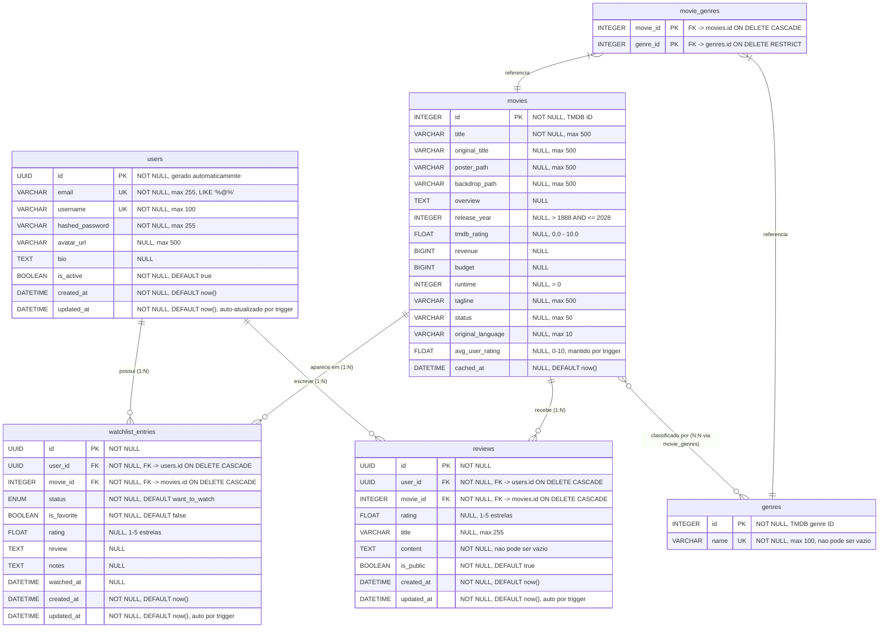

# MER/DER - CineList

## Diagrama Entidade-Relacionamento (Mermaid erDiagram)

---

## Cardinalidades

| Relacionamento                   | Tipo | Descricao                                          |
|----------------------------------|------|----------------------------------------------------|
| users -> watchlist_entries       | 1:N  | Um usuario tem muitas entradas na watchlist        |
| users -> reviews                 | 1:N  | Um usuario escreve muitas reviews                  |
| movies -> watchlist_entries      | 1:N  | Um filme aparece em muitas watchlists              |
| movies -> reviews                | 1:N  | Um filme recebe muitas reviews                     |
| movies <-> genres (movie_genres) | N:N  | Um filme tem varios generos; genero em varios filmes |

---

## Constraints de Unicidade (UNIQUE)

| Tabela              | Colunas             | Nome                   | Significado                                 |
|---------------------|---------------------|------------------------|---------------------------------------------|
| users               | email               | ix_users_email (UK)    | Email unico por usuario                     |
| users               | username            | ix_users_username (UK) | Username unico por usuario                  |
| genres              | name                | uq_genres_name         | Nome de genero unico                        |
| movie_genres        | (movie_id, genre_id)| movie_genres_pkey (PK) | Sem duplicatas na associacao                |
| watchlist_entries   | (user_id, movie_id) | uq_watchlist_user_movie| Um filme so aparece uma vez por watchlist   |
| reviews             | (user_id, movie_id) | uq_review_user_movie   | Um usuario so pode ter uma review por filme |

---

## Indexes

| Index                          | Tabela            | Coluna(s)          | Tipo    |
|--------------------------------|-------------------|--------------------|---------|
| ix_users_email                 | users             | email              | UNIQUE  |
| ix_users_username              | users             | username           | UNIQUE  |
| ix_movies_tmdb_rating          | movies            | tmdb_rating        | BTREE   |
| ix_movies_release_year         | movies            | release_year       | BTREE   |
| ix_movies_cached_at            | movies            | cached_at          | BTREE   |
| ix_movie_genres_genre_id       | movie_genres      | genre_id           | BTREE   |
| ix_watchlist_user_status       | watchlist_entries | (user_id, status)  | BTREE   |
| ix_watchlist_entries_user_id   | watchlist_entries | user_id            | BTREE   |
| ix_watchlist_entries_movie_id  | watchlist_entries | movie_id           | BTREE   |
| ix_reviews_movie_id            | reviews           | movie_id           | BTREE   |
| ix_reviews_user_id             | reviews           | user_id            | BTREE   |
| ix_reviews_created_at          | reviews           | created_at         | BTREE   |

---

## Triggers

| Trigger                              | Tabela            | Funcao                       | Evento              |
|--------------------------------------|-------------------|------------------------------|---------------------|
| trg_users_updated_at                 | users             | fn_set_updated_at()          | BEFORE UPDATE       |
| trg_watchlist_entries_updated_at     | watchlist_entries | fn_set_updated_at()          | BEFORE UPDATE       |
| trg_reviews_updated_at               | reviews           | fn_set_updated_at()          | BEFORE UPDATE       |
| trg_reviews_avg_rating               | reviews           | fn_update_movie_avg_rating() | AFTER INSERT/UPDATE/DELETE |

---

## View

**v_user_watchlist_stats** - Estatisticas agregadas por usuario:
- total_entries, total_watched, total_watching, total_want_to_watch, total_dropped
- total_favorites, avg_personal_rating, total_reviews
